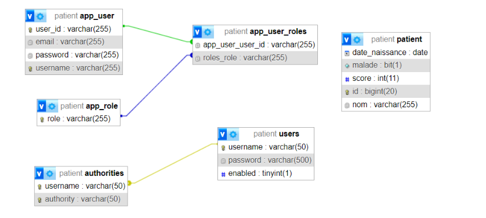

<h1>Rapport de TP N° 3_4 : Projet Spring Boot avec Spring Security</h1>
<h2>Development Web JEE Spring MVC</h2>
<h3>Introduction</h3>
Ce rapport détaille le développement d'une application web sécurisée avec Spring Boot et Spring Security, axée sur la gestion des patients. Le processus englobe la création d'un projet avec les dépendances requises, l'implémentation des entités JPA pour les patients, la configuration de la persistance des données, la mise en place d'un contrôleur Spring MVC et la création de vues Thymeleaf. La flexibilité de connexion à H2 ou MySQL est une caractéristique clé du projet. La sécurité est renforcée par l'intégration de Spring Security avec trois stratégies d'authentification : InMemoryAuthentication, JdbcAuthentication, et UserDetailsService. L'objectif final est de fournir une application web opérationnelle, adaptable et sécurisée, en exploitant de manière judicieuse les fonctionnalités offertes par Spring Boot et Spring Security.

<h3>Ennoncé</h3>

<ul>
Créer une application Web JEE basée sur Spring MVC, Thylemeaf et Spring Data JPA qui permet de gérer les patients. L'application doit permettre les fonctionnalités suivantes :

<li>Stocker les patiens dans H2 DataBase puis dans MySQL</li>
<li>Afficher les patients</li>
<li>Faire la pagination</li>
<li>Chercher les patients</li>
<li>Ajouter un patient</li>
<li>Modifier un patient</li>
<li>Supprimer un patient</li>
<li>Sécuriser les données des utilisateurs</li>
<li>Gérer les droits d'accès</li>
</ul>

<h3>Objectifs</h3>
<ul>
Créer un projet spring boot avec les dépendances Web, Spring Data JPA, H2, Lombok, Thymeleaf</li>
<li>Créer l'entité JPA Patient</li>
<li>Créer l'interface PatientRepository basée sur Spring Data</li>
<li>Configurer l'application pour se connecter soit à h2 Database ou à MySQL (application properties)</li>
<li>Créer le contrôleur Spring MVC</li>
<li>Créer les vues basées sur Thymeleaf</li>
<li>Sécuriser cette application en intégrant un système d'authentification basé sur Spring security avec les trois stratégies:
InMemoryAuthentication,
JdbcAuthentication,
UserDetailsService </li>
</ul>
<h3>Conception</h3>

<h3>Réalisation</h3>
