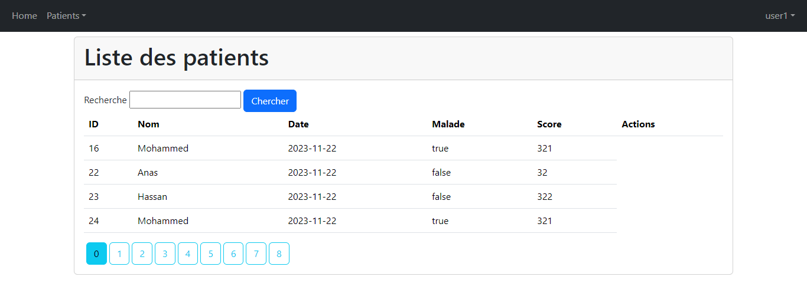

<h1>Rapport de TP N° 3_4 : Projet Spring Boot avec Spring Security</h1>
<h2>Development Web JEE Spring MVC</h2>
<h2>Introduction</h2>
Ce rapport détaille le développement d'une application web sécurisée avec Spring Boot et Spring Security, axée sur la gestion des patients. Le processus englobe la création d'un projet avec les dépendances requises, l'implémentation des entités JPA pour les patients, la configuration de la persistance des données, la mise en place d'un contrôleur Spring MVC et la création de vues Thymeleaf. La flexibilité de connexion à H2 ou MySQL est une caractéristique clé du projet. La sécurité est renforcée par l'intégration de Spring Security avec trois stratégies d'authentification : InMemoryAuthentication, JdbcAuthentication, et UserDetailsService. L'objectif final est de fournir une application web opérationnelle, adaptable et sécurisée, en exploitant de manière judicieuse les fonctionnalités offertes par Spring Boot et Spring Security.

<h2>Ennoncé</h2>

<ul>
Créer une application Web JEE basée sur Spring MVC, Thylemeaf et Spring Data JPA qui permet de gérer les patients. L'application doit permettre les fonctionnalités suivantes :

<li>Stocker les patiens dans H2 DataBase puis dans MySQL</li>
<li>Afficher les patients</li>
<li>Faire la pagination</li>
<li>Chercher les patients</li>
<li>Ajouter un patient</li>
<li>Modifier un patient</li>
<li>Supprimer un patient</li>
<li>Sécuriser les données des utilisateurs</li>
<li>Gérer les droits d'accès</li>
</ul>

<h2>Objectifs</h2>
<ul>
Créer un projet spring boot avec les dépendances Web, Spring Data JPA, H2, Lombok, Thymeleaf</li>
<li>Créer l'entité JPA Patient</li>
<li>Créer l'interface PatientRepository basée sur Spring Data</li>
<li>Configurer l'application pour se connecter soit à h2 Database ou à MySQL (application properties)</li>
<li>Créer le contrôleur Spring MVC</li>
<li>Créer les vues basées sur Thymeleaf</li>
<li>Sécuriser cette application en intégrant un système d'authentification basé sur Spring security avec les trois stratégies:
InMemoryAuthentication,
JdbcAuthentication,
UserDetailsService </li>
</ul>
<h2>Conception</h2>

<h2>Réalisation</h2>
<h3>Pages Accessibles par Admin</h3>
<li>Affichage des patients avec la pagination</li>

<li>Chercher les patients</li>

<li>Ajouter un patient</li>

Validation des données
<li>Ajout de l'annotation de validation Spring : @Valid</li>
<li>Ajout des annotations de validation appropriées sur les champs concernés.</li>
<li>Au niveau du contrôleur, utilisation de @Valid et de l'objet BindingResult pour gérer les résultats de la validation.</li>
<li>Enfin, au niveau du code HTML, utilisation de l'expression Thymeleaf th:errors pour afficher les messages d'erreur en cas de validation échouée.</li>

<li>Modifier un patient</li>

<li>Supprimer patient</li>

<h3>Pages Accessibles par un User</h3>
Les utilisateurs normaux ont un accès restreint, focalisé sur la consultation des données. Ils peuvent parcourir la liste des patients et effectuer des recherches.

Visualiser la liste des patient

Chercher un patient

<h2>Partie securité :</h2>

Sécuriser cette application en intégrant un système d'authentification basé sur Spring security .

a.Installation de Spring Security

Un mot de passe est généré et constitue le seul moyen d'accéder à cette page.

Pour personnaliser la configuration de spring security:on creer la classe 
SecurityConfig dans le package security.
Plutôt que d'opter pour l'approche traditionnelle avec les requêtes HTTP autorisées dans la configuration de sécurité, nous préférons désactiver la préconfiguration en utilisant @EnableMethodSecurity(prePostEnabled = false). Ensuite, dans le contrôleur, nous adoptons une approche plus flexible avec l'annotation @PreAuthorize("hasRole('ROLE_ADMIN')"). Ce changement offre une gestion plus granulaire des autorisations directement au niveau des méthodes, offrant ainsi une solution plus élégante et adaptable pour définir les autorisations en fonction des rôles des utilisateurs.

Voici les trois méthodes d'authentification distinctes :

InMemoryAuthentication
InMemoryAuthentication est une méthode d'authentification de Spring Security qui permet de stocker les informations d'identification directement en mémoire, particulièrement adaptée aux scénarios de développement légers ou lorsque la gestion des utilisateurs est minimale. Dans cette approche, les informations d'identification, telles que les noms d'utilisateur, mots de passe et rôles, sont configurées statiquement dans la mémoire de l'application. Cette méthode offre une gestion rapide et simple des utilisateurs au niveau de la configuration de l'application, sans nécessiter de stockage persistant, et est souvent utilisée pour des tests et des développements rapides.

JdbcAuthentication
JdbcAuthentication est une méthode qui repose sur une source de données JDBC (Java Database Connectivity) pour stocker et récupérer les informations d'identification des utilisateurs. Les informations, telles que les noms d'utilisateur, mots de passe et rôles, sont stockées dans une base de données relationnelle telle que MySQL, PostgreSQL, ou H2. L'authentification se fait en interrogeant cette base de données pour vérifier les informations d'identification fournies lors de la connexion. Cette approche offre une gestion centralisée des utilisateurs, facilitant les mises à jour sans nécessiter de modifications directes dans le code de l'application.

UserDetailsService
UserDetailsService quant à elle,est une interface de Spring Security permettant de charger les informations d'identification des utilisateurs à partir d'une source externe personnalisée. Les classes implémentant cette interface définissent leur propre logique pour charger les informations d'identification à partir de sources diverses, telles que des bases de données, des services web, ou d'autres systèmes d'authentification personnalisés. Cette méthode offre une flexibilité considérable, adaptée aux situations où la gestion des utilisateurs est complexe ou nécessite des intégrations spécifiques avec des systèmes existants. Les informations d'identification peuvent être stockées dans différentes sources, avec la logique de chargement définie selon les besoins spécifiques de l'application.

Sécuriser les données des utilisateurs:

Pour assurer la sécurité des données des utilisateurs, nous adoptons une méthode de stockage sécurisé des mots de passe. L'utilisation d'un encodeur de mot de passe, tel que BCryptPasswordEncoder, est illustrée par l'instruction passwordEncoder.encode("1234"). Cela démontre que le mot de passe "1234" est haché à l'aide de l'encodeur de mot de passe avant d'être stocké en mémoire. Cette pratique courante renforce la sécurité en stockant les mots de passe sous forme de hachages plutôt qu'en texte brut, réduisant ainsi les risques associés au stockage d'informations sensibles.

Gérer les droits d'accès

Pour afficher la liste des patients, nous avons utilisé Thymeleaf, un moteur de template, pour rendre dynamique l'affichage des données des patients. De plus, WebJars a été utilisé pour intégrer des styles modernes provenant de bibliothèques externes, créant ainsi une présentation efficace et agréable des informations sur les patients. Cette approche assure une expérience visuelle cohérente et attrayante pour les utilisateurs. De plus, les droits d'accès ont été configurés pour permettre à tous les utilisateurs d'afficher les données, avec des restrictions fonctionnelles spécifiques pour les utilisateurs ordinaires, tandis que les utilisateurs ayant des droits d'administration bénéficient d'un accès étendu et de fonctionnalités supplémentaires.

<h2>Conclusion</h2>

Le rapport présente un projet de développement web JEE avec Spring MVC, axé sur la gestion complète des patients en utilisant les frameworks Spring Boot et Spring Security. Le projet inclut des fonctionnalités CRUD, une sécurité robuste avec trois stratégies d'authentification différentes, et la prise en charge de deux bases de données, H2 et MySQL. Le rapport détaille la conception, la réalisation, et les différentes fonctionnalités mises en œuvre, notamment l'affichage, la pagination, la recherche, l'ajout, la modification et la suppression des patients. La gestion des droits d'accès différenciés entre administrateurs et utilisateurs normaux.
